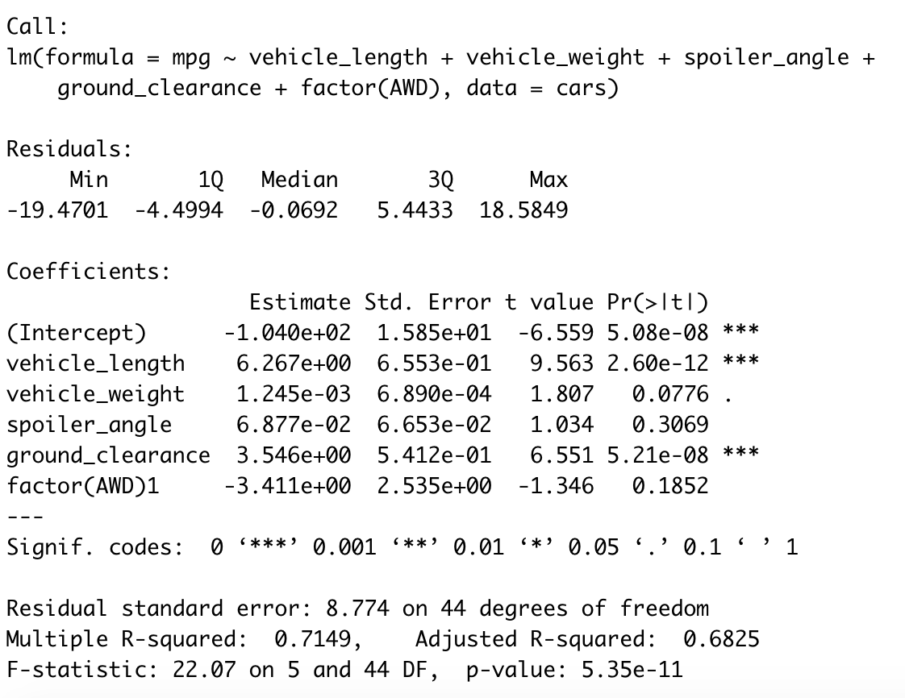
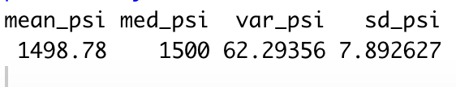
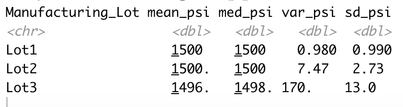
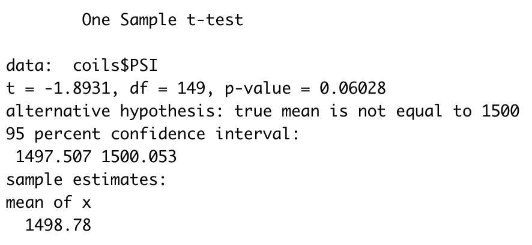
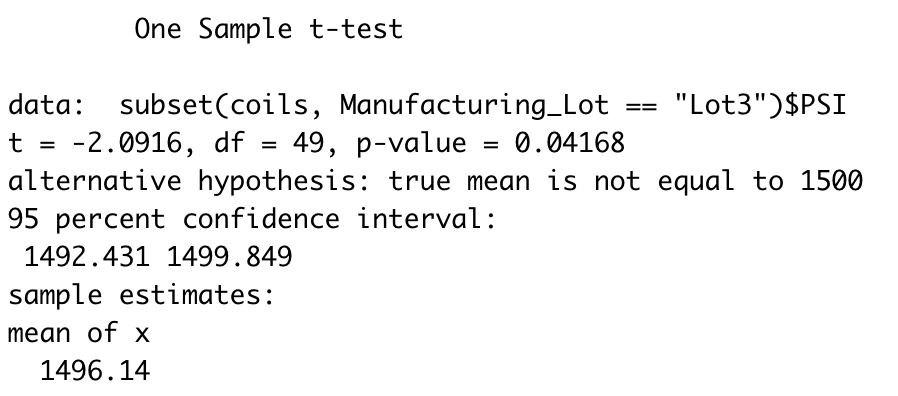

# MechaCar_Statistical_Analysis

## Overview

Here, I used R to conduct statistical analyses of car performance data. Specifically, I produced a linear model to
identify car features that predict gas mileage, I summarized data on spring coil performance from different production lots,
and I conducted a series of t-tests to test for potential variation in coil performance in different lots. The specifics of 
these analyses are summarized below, followed by a description of a follow-up study design.

## Linear Regression to Predict MPG

- Using a significance cutoff of \alpha=0.05, vehicle length and ground clearance both contributed non-random variance to mileage (MPG), 
whereas vehicle weight, spoiler angle, and whether or not a car uses all wheel drive could not explain variance in MPG:

 
- Because two variables significantly predicted MPG (resulting in an overall significant model: p = 5.35e-11), we can infer that
the model slope is not 0. 

- The model does effectively predict MPG: it is highly significant and explains a respectable amount of variance (r^2=0.715). 
However, it is overfitted with unnecessary (non-significant) parameters, and a more appropriate model would include only 
vehicle length and ground clearance as predictors. 

## Summary Statistics on Suspension Coils

- Across all manufacturing lots, mean and median suspension coil performance (measured in pounds per square inch, PSI) remain
close to the desired 1500 PSI. Similarly, variance in performance is within the desired range of 100 PSI^2:

- However, analyzing lots individually reveals that variance is excessively high in lot 3. All lots perform as desired on average,
however performance in lot 3 is too variable (lot 3 variance = 170.3 PSI^2): 

## T-Tests on Suspension Coils

- By more formally analyzing mean suspension coil performance using a t-test, performance across all lots does not significantly
differ from a population mean of 1500 PSI:

- When analyzing lots individually, both lots 1 and 2 were statistically equivalent to a mean of 1500. However, lot 3 (mean = 1496)
was significantly different from 1500:

## Study Design: MechaCar vs Competition

One potential way to compare the performance of MechaCar vehicles versus competitor models would be to compare how fuel efficiency and horsepower 
trade-off between manufacturers. Consumers value both high efficiency and high horsepower, but the two are negatively related, so any way to
minimize reductions in efficiency with increasing horsepower would be valuable. Using this trade-off could be a useful way to compare performance
between competing companies. 

- Factors: The broadest comparisons would be between companies: MechaCar vs. say, Ben's Car Co (BenCar). Within each company, I would group
cars by their general model type (e.g., compact sedan, midsize sedan, and SUV). For simplicity's sake, I'll focus on one comparison
here: MechaCar SUVs vs. BenCar SUVs. 

- Measurements: I would measure 100 MechaCar and 100 BenCar SUVs. For each individual SUV, I would measure average fuel efficiency (mpg) 
and horsepower (watts) at nine different speeds: 20, 30, 40, 50, 60, 70, 80, 90, and 100 mph. For a given company and a given speed, I would define 
the trade-off between efficiency and horsepower by running a linear regression for all 100 SUVs' horsepower (the independent variable) vs. efficiency (dependent 
variable). Because fuel efficiency should decrease with increasing horsepower, the slope of this regression will be negative. However, a "less" 
negative slope (i.e., a shallower slope, closer to m=0 relative to another line) will be indicative of an SUV that does not lose as much
efficiency with increasing horsepower, representing a better tradeoff between the two variables. As such, I would define the tradeoff as absolute value of
the fitted model slope. Using this trade-off index, a smaller value is reflective of a shallower slope and of more desirable performance. 

- Questions: The general questions for this study would be "Do MechaCar and BenCar SUVs differ in how well they trade-off fuel efficiency and horsepower?"

- Hypotheses: 

	- Null: MechaCar and BenCar SUVs do not differ in their efficiency/horsepower trade-off.
	- Alternative: MechaCar and BenCar SUVs show different trade-offs between efficiency and horsepower.
	
- Statistical tests: I would conduct three tests of these hypotheses.

	1. Two-sample t-test (holistic): This general t-test would compare the sample of all MechaCar trade-off indexes (across all speeds)
	to all BenCar indexes. Specifically, 100 MechaCar SUVs x 9 speeds = 900 MechaCar indexes vs. 900 BenCar indexes. This test effectively 
	examines if, on aggregate, the two companies differ in their trade-off performance. If the test reveals one company to have significantly lower
	index values, this would be strong evidence of better performance across driving speeds.
	
	2. Two-sample t-tests (one per speed): I would conduct nine more t-tests grouped by each measured speed (100 MechaCar vs. 100 BenCar per test).
	These tests provide a more fine-grained examination of differences in performance at a given driving condition. Even if one company doesn't show
	better performance across all speeds, or if the holistic t-test is not significant, any one of these tests may reveal more detailed, context-specific
	differences in performance. 
	

	3. Multiple linear regression: I would perform one additional linear regression to test for a relationship between speed (independent variable)
	and the interaction between trade-off index and company. A significant effect for either company would be indicative of consistently improving (or decreasing) 
	trade-off performance with increasing speeds for that company's SUVs. If a company valued prioritizing trade-off performance at a certain speed or range 
	of speeds, results from these models could be used to identify whether performance slopes were meeting those expectations. This model can also be used 
	to test for differences in trends between companies, which could be used to determine whether companies differ in how their SUVs vary in trade-offs with speed. 